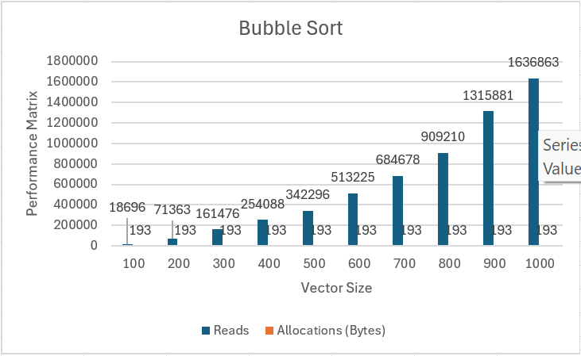
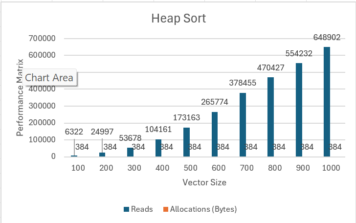
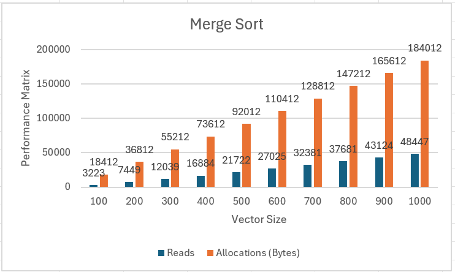
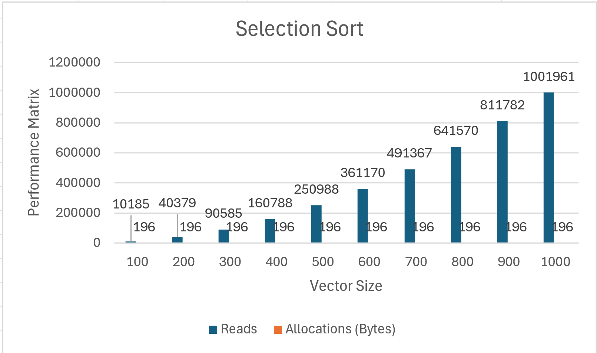

# Project 4 Report

Answer the following prompts directly in this file:
* Information about your dataset (you will be assigned a different grader for this project).
* Analyze the data. Graph the number of reads and allocations for each sorting algorithm and look at how the number of reads and allocations grows when the size of the data set grows. Compare and contrast the different sorting algorithms and draw conclusions about which sorting algorithms are more efficient. Discuss complexities and their effects.
* Look at the output from the stabilityTest function and answer the following questions:
  * How are the names sorted by default?
  * How is the output from the two stable sorting algorithms different from the two unstable ones? Be specific in your answer, and use what you know about how each sorting algorithm works to justify your observations.
* Answers to the following questions: 
  * If you need to sort a contacts list on a mobile app, which sorting algorithm(s) would you use and why? 
  * What about if you need to sort a database of 20 million client files that are stored in a datacenter in the cloud?
 
  * The 8 attributes in this project are the National Database Number(ndn), Common name, Species, State(that they were sighted in), date sighted, longitude, Latitude, Length. I got the data from https://www.fisheries.noaa.gov/national/marine-life-distress/national-stranding-database-public-access?utm_source=chatgpt.com. After looking around I thought that the large whale data was interesting data also I think that sea creatures are cool. The data is in order of date collected from oldest to newest from the years of 2005-2015. In order to check to see if the function was working correctly I used the command f to find something and searched up the term I wanted to count and it matched the number that was being output by my code. I chose the number of killer whales there were in the data set so created a function that would display the answer.
 
  * 
  * 
  * 
  * 
    
In Bubble, Heap, and Selection Sort it is difficult to see the allocations due to the large number of reads, but all three have constant auxiliary, which is evident because the number of allocations doesn’t change with the size of the vectors. The graph that stands out is Merge sort, which is the only sorting system that doesn’t have a constant auxiliary, and it is the only one that at any point has more allocations that read at any point. Then, in bubble and selection sort you can start to see the quadratic time complexity show as the time vector size increases the number of reads by more. The merge and heap sorts’ reads still increase but not by as much each time with displays their O(NLog N) Time Complexity. Therefore, as the size of the data increases, the heap and merge will be faster than the bubble and selection. Also, Bubble heap and selection are more memory efficient. So heap sort is the fastest and most memory efficient for this data set.

Originally, the contact names are sorted alphabetically by first name. As Bubble and Merge sort are stable, they sort by last name and keep the same last name in the same relative order they were in before they were sorted, so both output the exact same list. This is because Bubble only swaps adjacent elements if they are out of order, and equal items will not swap. Merge if two elements are equal will always choose the left element. Heap sort puts Jordan black before Blake Black when Blake Black was originally in front of Jordan Black. Selection sort put Kelsey Brown before Jamie Brown when originally Jamie Brown was in front of Kelsey Brown. Heap sort swaps the root with the last unsorted element which can mix up equal elements. Selection sort selects the minimum and swaps it with the current position, which can also mix up elements.

For the mobile app I recommend Merge sort because it is stable, which means it will keep people with the last name sorted in their original order.  Also, O(n log n) time complexity is efficient for all size lists. Also has a consistent performance unlike the bubble sort and the heap and selection are unstable, which would be annoying to find someone as their name jumps around unpredictably.

for the 20 million client data center I recommend heap sort, which will be efficient for such a large set of data with O(n log n) time complexity and memory efficient for external sorting with O(1) auxiliary complexity. Unlike merge, which would require a larger amount of space with O(n), which would be very expensive for 20 million records. Then Bubble and selection are slow for large data sets.

**Note: Any code that was not authored by yourself or the instructor must be cited in your report. This includes the use of concepts not taught in lecture.**
